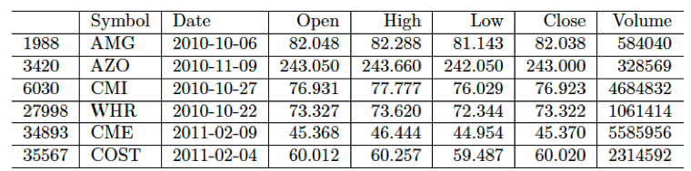
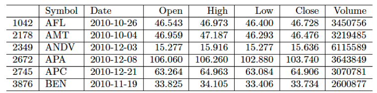
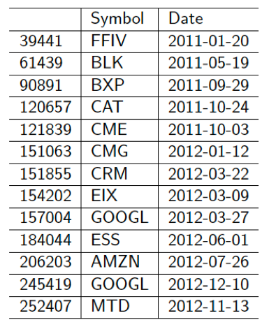
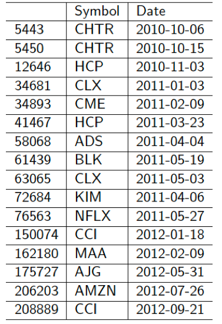
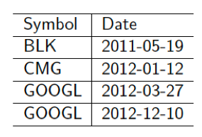
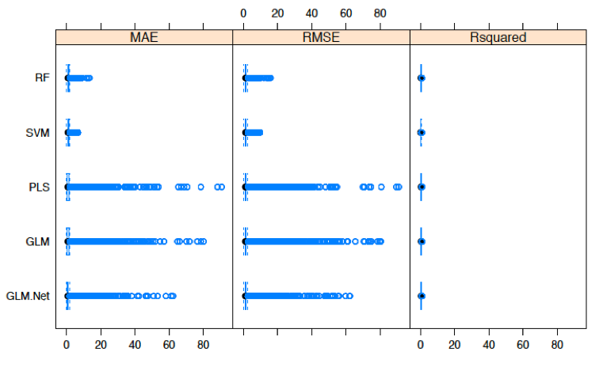
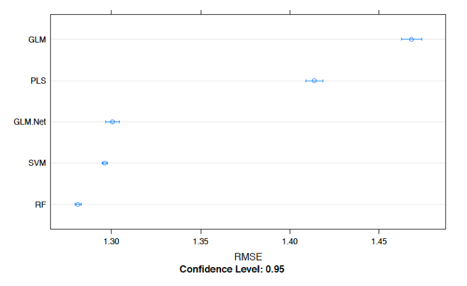

# Anomaly Detection: Stock Market
# Dataset
## Price and Volume Data for all US Stocks 
This dataset is comprised of over 14 million observations and 7 columns. The variables consist of:
- Symbol
- Date
- Open
- High
- Low
- Close
- Volume  

# Feature Creation
- Open Close Percentage Change 
- Open Close Delta 
- Open Change 
- High Change 
- Low Change 
- Close Change 
- Volume Change 
- Daily Return 
- Open Percentage Change 
- High Percentage Change 
- Low Percentage Change 
- Close Percentage Change
- Volume Percentage Change 
- Open 10 and 30 day average 
- High 10 and 30 day average
- Low 10 and 30 day average
- Close 10 and 30 day average
- Volume 10 and 30 day average
- Open 10 and 30 day rolling average
- High 10 and 30 day rolling average
- Low 10 and 30 day rolling average
- Close 10 and 30 day rolling average
- Volume 10 and 30 day rolling average
- Open 30 day rolling standard deviation 
- High 30 day rolling standard deviation
- Low 30 day rolling standard deviation
- Close 30 day rolling standard deviation
- Volume 30 day rolling standard deviation
- Open 30 day rolling variance
- High 30 day rolling variance
- Low 30 day rolling variance
- Close 30 day rolling variance
- Volume 30 day rolling variance
- Open exponential moving average for 10 and 30 days 
- High exponential moving average for 10 and 30 days 
- Low exponential moving average for 10 and 30 days 
- Close exponential moving average for 10 and 30 days 
- Volume exponential moving average for 10 and 30 days 

# Modeling Techniques
## GLM
In order to detect possible outliers, I trained several GLM models for normal using Open Close % Change
and Volume % Change as my response variables. 

Response = Open Close % Change
- Predictors = Most Variables
- Predictors = 16 Most Important Variables
- Predictors = 4 Most Important Variables

Response = Volume % Change
- Predictors = Most Variables
- Predictors = 9 Most Important Variables
- Predictors = 4 Most Important Variables

When modeling for Open Close % Change my best model used the top 4 most important variables shown here. 

4 Most Important Variables
- Low Change
- Volume Change
- Volume EMA10
- High Change

Open Close % Change: Modeling for Open Close % Change resulted in 49 possible outliers as the actual Open Close % Change differed significantly from the value predicted by the GLM model. These data points required additional analysis to determine if the anomaly
detection was correct. 

After, viewing the data points it is difficult to determine that any of the data points are true anomalies. For example, on 1/12/12 CMG’s closing price was flat versus its opening price. However, my model predicted a 12% decline. It’s difficult to say that my model is correct and that the stock should have traded down significantly instead of flat. Particularly given that the stock traded in a narrow band the
week prior to 1/12/12 and the week after (-2% - +3%).

When modeling for Volume % Change my best model used the top 4 most important variables shown here. 

4 Most Important Variables
- Low Change
- Volume Change
- Volume EMA10
- High Change

Volume % Change: Modeling for Volume % Change resulted in 203 possible outliers as the actual Volume % Change differed significantly from the value predicted by the GLM model. These data points required additional analysis to determine if the anomaly detection was correct.

After, viewing the original data, I found it difficult to determine that these data points were true outliers. For example, on 5/21/12 ISRG’s volume was basically flat versus the prior day. However, my model predicted a 67% change. In the week prior to and after 5/21/12 ISRG’s volume percent change ranged from -26% to +49%. 

Interestingly, while modeling for normal there was no possible outlier data points in common between modeling for Open Close % Change and Volume % Change.

## RF
In order to detect possible outliers, I trained several RF models for normal using Open Close % Change and Volume % Change as my response variables. 

Response = Open Close % Change
- Predictors = Most Variables
- Predictors = 16 Most Important Variables
- Predictors = 4 Most Important Variables

Response = Volume % Change
- Predictors = Most Variables
- Predictors = 16 Most Important Variables
- Predictors = 4 Most Important Variables

When modeling for Open Close % Change my best model used the top 4 most important variables shown here. 

4 Most Important Variables
- Close PctChange
- Open PctChange
- Open Change
- Close Change

Open Close % Change: Modeling for Open Close % Change resulted in 13 possible outliers as the actual Open Close % Change differed significantly from the value predicted by the RF model. These data points required additional analysis to determine if the anomaly detection was correct.

When modeling for Volume % Change my best model used the top 4 most important variables shown here. 

4 Most Important Variables
- Volume EMA10
- Volume Change
- Volume Mean30 R
- High PctChange

Volume % Change: Modeling for Volume % Change resulted in 16 possible outliers as the actual Volume % Change differed significantly from the value predicted by the RF model. These data points required additional analysis to determine if the anomaly detection was correct.

Overall, my RF models predicted greater change in Open Close % Change and Volume % Change than actually occurred. However, upon further inspection I was unable to definitively say that my model was more correct than the actual results.

## Both RF and GLM models
I then looked to see if my RF and GLM models came up with the same possible outliers. Both RF and GLM models when modeling for Open Close % Change found 4 overlapping data points:

BLK: 5/19/11 BLK’s closing price was flat versus its opening price. However, my model predicted a 5% decline. It’s difficult to say that my model is correct and that the stock should have traded down significantly instead of flat. Particularly given that the stock traded in a narrow band the week prior to 5/19/11 and the week after (-1% - +1%).

CMG: 1/12/12 CMG’s closing price was flat versus its opening price. However, my model predicted a 12% decline. Again, it’s difficult to say that my model is correct and that the stock should have traded down significantly instead of flat. Particularly given that the stock traded in a narrow band the week prior to 1/12/12 and the week after (-2% - +3%).

GOOGL: 3/27/12 GOOGL’s closing price was flat versus its opening price. However, my model predicted a 3.4% increase. It’s difficult to say that my model is correct and that the stock should have traded up. Particularly given that the stock traded in a narrow band the week prior to 3/27/12 and the week after (-2% - +1%). 12/10/12 GOOGL’s closing price was flat versus its opening price. However, my model predicted a 2% increase. It’s difficult to say that my model is correct and that the stock should have traded up instead of
flat. Particularly given that the stock traded in a narrow band the week prior to 12/10/12 and the week after
(-2% - +2%).

## Automated Machine Learning
Used Caret Package to Train 5 Models 
- Generalized Linear Model
- Random Forest
- Partial Least Squares
- GLMNET
- SVM Radial

You can see the performance metrics of each of these models below. 
### Box Plots of Metrics

### RMSE Metrics

RF resulted in the lowest RMSE, I therefore used RF as my best model and trained it on the entire training set.  I then predicted open close percentage change on my test set.  

### Outliers
My model determined 3 possible outliers.  Upon further inspection it's difficult to say that my model is correct and that the stock should have traded differently as it actually did. 

CMI: On 2016-11-11 CMI’s closing price was flat versus its opening price. My model predicted a 2% decline.

ISRG: On 2016-12-13 ISRG’s closing price was flat versus its opening price. My model predicted a 2% increase.

REGN: On 2016-10-27 REGN’s closing price was flat versus its opening price. My model predicted a 1% increase.
