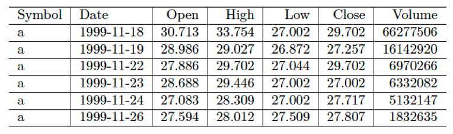

# Anomaly Detection: Stock Market
# Dataset
## Price and Volume Data for all US Stocks 
This dataset is comprised of over 14 million observations and 7 columns. The variables consist of:
- Symbol
- Date
- Open
- High
- Low
- Close
- Volume  

# Feature Creation
- Open Close Percentage Change 
- Open Close Delta 
- Open Change 
- High Change 
- Low Change 
- Close Change 
- Volume Change 
- Daily Return 
- Open Percentage Change 
- High Percentage Change 
- Low Percentage Change 
- Close Percentage Change
- Volume Percentage Change 
- Open 10 and 30 day average 
- High 10 and 30 day average
- Low 10 and 30 day average
- Close 10 and 30 day average
- Volume 10 and 30 day average
- Open 10 and 30 day rolling average
- High 10 and 30 day rolling average
- Low 10 and 30 day rolling average
- Close 10 and 30 day rolling average
- Volume 10 and 30 day rolling average
- Open 30 day rolling standard deviation 
- High 30 day rolling standard deviation
- Low 30 day rolling standard deviation
- Close 30 day rolling standard deviation
- Volume 30 day rolling standard deviation
- Open 30 day rolling variance
- High 30 day rolling variance
- Low 30 day rolling variance
- Close 30 day rolling variance
- Volume 30 day rolling variance
- Open exponential moving average for 10 and 30 days 
- High exponential moving average for 10 and 30 days 
- Low exponential moving average for 10 and 30 days 
- Close exponential moving average for 10 and 30 days 
- Volume exponential moving average for 10 and 30 days 
